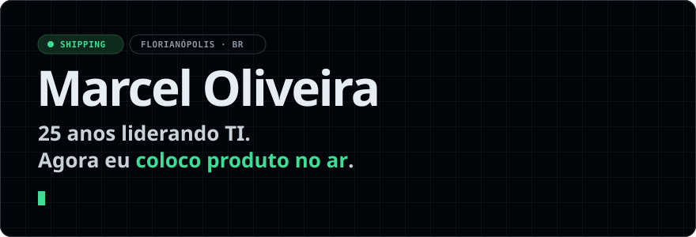
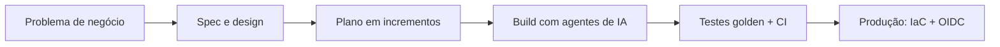

<picture>
  <source media="(prefers-color-scheme: dark)" srcset="assets/banner-dark.svg">
  <source media="(prefers-color-scheme: light)" srcset="assets/banner-light.svg">
  
</picture>

  

## Em produção

<table>
<tr>
<td width="50%" valign="top">

### Kalibra

<picture>
  <source media="(prefers-color-scheme: dark)" srcset="https://raw.githubusercontent.com/br-marcel-oliveira/br-marcel-oliveira/metrics/status-kalibra-dark.svg">
  <source media="(prefers-color-scheme: light)" srcset="https://raw.githubusercontent.com/br-marcel-oliveira/br-marcel-oliveira/metrics/status-kalibra-light.svg">
  
</picture>

SaaS de antropometria para clínicas e avaliadores físicos. Medidas de campo viram laudo profissional em segundos.

- **Motor científico:** Petroski, Siri, Heath-Carter, Kerr, Escala-O
- **Multi-tenant white-label:** isolamento por clínica no banco
- **Billing self-service** e clínica real operando

`FastAPI` `Next.js 16` `Postgres RLS` `Azure` `Terraform` `Stripe`

**[Conhecer o Kalibra →](https://www.kalibra.fitness)**

</td>
<td width="50%" valign="top">

### Gestão de Condomínio

<picture>
  <source media="(prefers-color-scheme: dark)" srcset="https://raw.githubusercontent.com/br-marcel-oliveira/br-marcel-oliveira/metrics/status-condominio-dark.svg">
  <source media="(prefers-color-scheme: light)" srcset="https://raw.githubusercontent.com/br-marcel-oliveira/br-marcel-oliveira/metrics/status-condominio-light.svg">
  
</picture>

Matou duas planilhas Excel. Rateio mensal de água e luz do início ao fim, sem digitação.

- **IA lê a fatura:** PDF ou foto viram campos conferidos
- **Morador envia a leitura** por link, com foto, sem login
- **Demonstrativo com Pix** por e-mail + livro caixa

`Next.js 16` `Supabase` `Gemini` `Resend` `Vercel cron`

código privado · uso próprio

</td>
</tr>
</table>

## Ao vivo

<picture>
  <source media="(prefers-color-scheme: dark)" srcset="https://raw.githubusercontent.com/br-marcel-oliveira/br-marcel-oliveira/metrics/live-dark.svg">
  <source media="(prefers-color-scheme: light)" srcset="https://raw.githubusercontent.com/br-marcel-oliveira/br-marcel-oliveira/metrics/live-light.svg">
  
</picture>

Gerado de hora em hora por GitHub Action a partir dos repositórios privados dos produtos. Só números agregados.

## Como eu entrego

Um operador, padrão de engenharia de time.

## De onde vem isso

| Operação crítica | ERP & dados | Times |
|---|---|---|
| TI 24x7 com alta disponibilidade e governança multiempresa | Modernização de ERP e arquitetura de dados do ERP ao BI | Reestruturação, times de alta performance e cibersegurança |

<b>Estilo de liderança</b>

 

Pragmático, orientado a resultado e execução. Visão estratégica com capacidade de descer ao detalhe quando necessário, garantindo que planejamento, operação e entrega estejam alinhados.

Foco em clareza de direção, responsabilização, performance consistente e evolução contínua do time.

## Stack

## Commits

<picture>
  <source media="(prefers-color-scheme: dark)" srcset="https://raw.githubusercontent.com/br-marcel-oliveira/br-marcel-oliveira/snake/snake-dark.svg">
  <source media="(prefers-color-scheme: light)" srcset="https://raw.githubusercontent.com/br-marcel-oliveira/br-marcel-oliveira/snake/snake-light.svg">
  
</picture>

---

**Construindo produto, liderando TI.** Bora trocar ideia sobre SaaS, dados e IA aplicada.

[**Conectar no LinkedIn →**](https://linkedin.com/in/br-marcel-oliveira)

